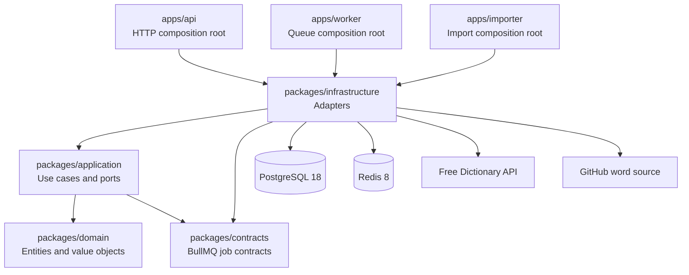
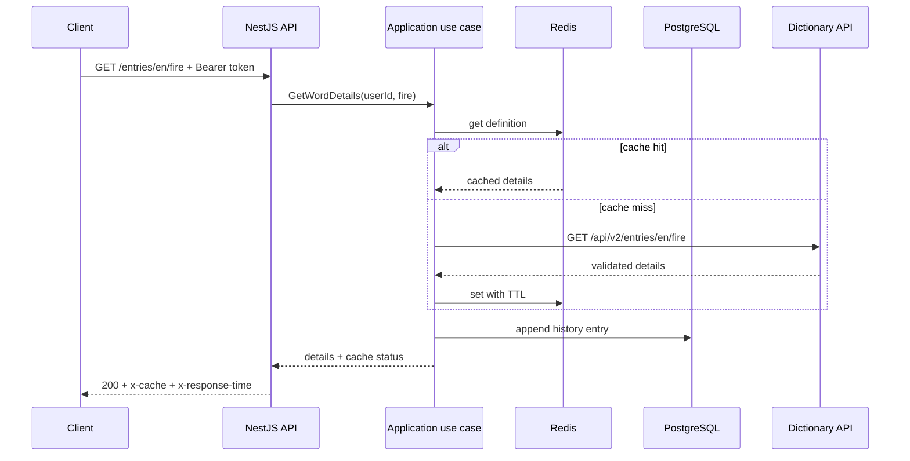
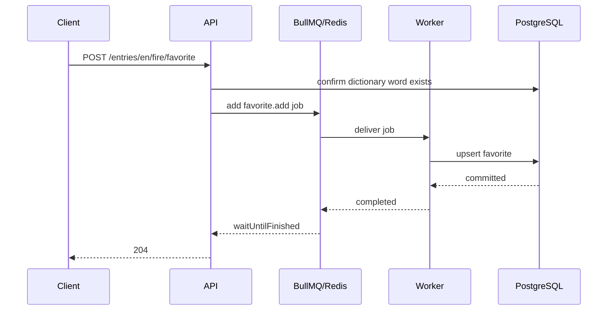
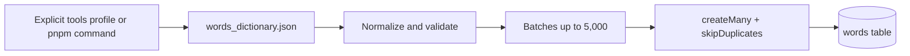

# Architecture

The solution is a pnpm and Turborepo monorepo with three independently
executable applications. It applies Clean Architecture with lightweight tactical
DDD: domain types express invariants, application use cases coordinate behavior,
and infrastructure implements external capabilities.

## Dependency Diagram

Dependencies point inward. Domain and application have no framework imports.

## Request Flow

## Favorite Flow

The bounded wait preserves the challenge's synchronous HTTP expectation while
the persistence mechanism remains asynchronous and independently scalable.

## Import Flow

The unique `words.word` index and `skipDuplicates` make repeated imports
idempotent.

## Dependency Rules

- Domain code has no framework or infrastructure dependencies.
- Application code defines small ports and coordinates domain behavior.
- Infrastructure adapters implement application ports.
- Apps are composition roots and own process lifecycle.
- Controllers validate transport input and delegate to one use case.
- Shared imports use package root exports rather than internal file paths.
- Redis is never the source of truth.
- Queue contracts are the only approved TypeScript namespace.

## Runtime Processes

- `api` serves the REST contract and OpenAPI documentation.
- `worker` consumes favorite jobs with configurable concurrency.
- `importer` is an explicit one-shot operation under the Compose `tools`
  profile.
- `migrate` applies committed Prisma migrations before API and worker startup.
- PostgreSQL stores users, words, history, and favorites.
- Redis stores cache entries and BullMQ state.

## Data Model

- `users.email` is unique; only `password_hash` is persisted.
- `words.word` is unique and has a `text_pattern_ops` prefix index.
- `history` is append-only and indexed by user and descending timestamp.
- `favorites` is unique by user and word for idempotency.
- Foreign keys cascade on user or word deletion.

## Operational Boundaries

- API, worker, and importer use separate processes and shutdown hooks.
- Connection providers are process-scoped singletons managed by NestJS.
- Queue jobs retry three times with exponential backoff.
- Cache TTL values, worker concurrency, endpoints, and credentials are
  environment-driven.
- Logs are structured JSON in production and exclude passwords and tokens.
- Correlation IDs are accepted from trusted callers or generated per request.

## Key Decisions

1. Use page/limit pagination to match the mandatory response contract.
2. Keep detail responses in Redis but always append history on successful views,
   including cache hits.
3. Wait for favorite jobs with a timeout so `204` confirms persistence.
4. Validate upstream JSON with Zod to protect the application boundary.
5. Use Argon2id hashing; use JWT signing, not payload encryption.
6. Avoid explicit Composite and Singleton implementations because the current
   domain and container lifecycle do not require them.
