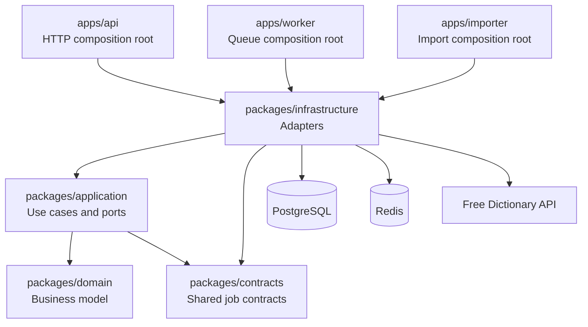

# Architecture

The solution is a pnpm and Turborepo monorepo with three independently
executable applications and four business packages.

## Dependency Rules

- Domain code has no framework or infrastructure dependencies.
- Application code defines ports and coordinates domain behavior.
- Infrastructure adapters implement application ports.
- Apps wire concrete implementations and own process lifecycle.
- Shared imports use package root exports rather than internal file paths.

## Runtime Processes

- `api` serves the challenge HTTP contract.
- `worker` processes asynchronous favorite commands.
- `importer` downloads and imports the English word list as an explicit one-shot
  operation.
- PostgreSQL is the source of truth.
- Redis provides caching and BullMQ transport.
